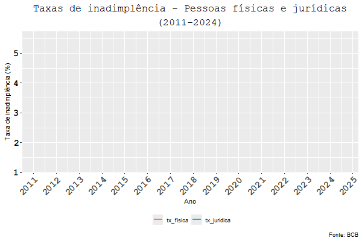
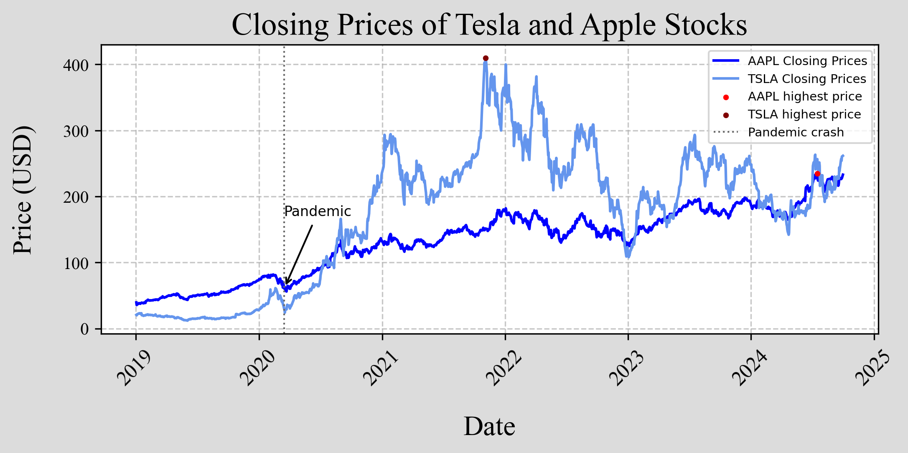
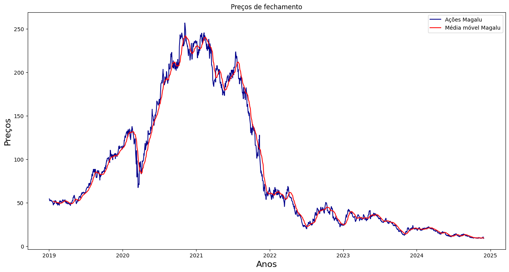
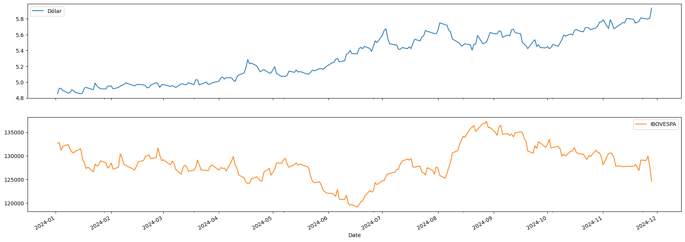

# Portfólio - Daniel Nunes Vital
### nunesvitald@gmail.com 

Listo abaixo alguns dos projetos que realizei utilizando R, Python e LaTex. *Outros projetos que realizei podem ser encontrados [aqui](https://github.com/Danieldnv/portfolio_pt/tree/main/outros_codigos)*  

# Explorando a PNADc
Nesse projeto, utilizei o pacote PNADcIBGE para importar os dados da pesquisa nacional por amostra de domicílio contínua *do 3º trimestre de 2024*, realizada pelo IBGE. Com os microdados obtidos, é possível calcular múltiplas variáveis e taxas da economia brasileira. Entre as diversas informações que calculei, algumas são:

* Taxa de desemprego do Brasil: 6,362%
* Taxa de desemprego da região metropolitana do Recife: 11,81%
* a renda média da população brasileira: 3267,7 reais, a renda média da mulher brasileira: 2817,6 reais, a do homem: 3605,2 reais e a da mulher preta pernambucana: 2151,2 reais.
* O percentual de mulheres brancas que tem de 20 a 30 anos e estão desempregadas: 8,479%.
* A proporção da população brasileira por raça (valores aproximados): 42% são brancos, 10% são pretos, 0,6% são amarelos, 46% são pardos, 0,4% são indígenas, 0,01% ignorados. 

  A pesquisa é de grande valia para diversas aplicações. Com os dados obtidos, é possível obter uma boa visão da situação econômica do país. Com o pacote criado pelos próprios funcionários do IBGE, existe uma função que me permite selecionar apenas as variáveis que desejo da PNADc, sem precisar enfrentar a carga de dados não necessários para o projeto em questão (mesmo assim, ainda é uma grande quantidade de informações).
[Acesse o código](https://github.com/Danieldnv/portfolio_pt/blob/main/codigos/pnadcibge_portfolio.R)

# Inadimplência da carteira de crédito: pessoas físicas e jurídicas do Brasil - gráfico animado
Com o pacote que obtém os dados com a API oficial do Banco central do Brasil, calculei a taxa mensal de inadimplência por pessoa física e jurídica (ver observação) , partindo de 2011 (a data final é a data do sistema), construí um gráfico utilizando o GGplot e animei o gráfico para mostrar a variação das taxas ao longo do tempo. 

   

  

Observação: De acordo com o site do banco central, a definição dos dados que trabalhei é: *Percentual da carteira de crédito do Sistema Financeiro Nacional com pelo menos uma parcela com atraso superior a 90 dias. Inclui operações contratadas no segmento de crédito livre e no segmento de crédito direcionado.* [Verifique aqui](https://dadosabertos.bcb.gov.br/dataset/21083-inadimplencia-da-carteira-de-credito---pessoas-juridicas---total)

[Acesse o código](https://github.com/Danieldnv/portfolio_pt/blob/main/codigos/animated_plot.R)

# Preços de fechamento das ações da Tesla e Apple
Utilizando a biblioteca "yfinance" (pacote que obtém dados através das APIs do yahoo finance), coletei as informações das ações das empresas mencionadas e gerei um gráfico destacando o preço mais alto para cada ativo durante período análisado (01/01/2019 até 01/10/2024), além de incluir o principal impacto na queda das ações causado pela pandemia. É possível observar que, apesar de grande queda durante o COVID-19, os preços de ambas as ações se recuperaram e subiram em taxas muito altas.  

   

  

[Acesse o código](https://github.com/Danieldnv/portfolio_pt/blob/main/codigos/acoes_dolar_ibov.ipynb)

# MGLU3, dólar e índice ibovespa
Nesse projeto, também utilizando a "yfinance", construí um gráfico do preço de fechamento da ação da magazine luiza e a sua média móvel no período analisado.
Também observei a variação do índice ibovespa e do dólar para o mesmo perído, sendo possível, a partir dos gráficos, comparar o desempenho e correlação da variação do índice em função do dólar.  

   

   

  

[Acesse o código](https://github.com/Danieldnv/portfolio_pt/blob/main/codigos/acoes_dolar_ibov.ipynb)

# LaTex
Apesar de não ser voltado diretamente a ciência de dados, acredito que com as habilidades que desenvolvi ao realizar esses projetos, posso contribuir grandemente para trabalhos em LaTex, caso seja uma demanda da empresa. O código constrói integrais, derivadas expoentes, divisões, multiplicações, chaves, gráfico, letras gregas e outros símbolos 
## Matemática - LaTex 

   

  

[Acesse o código](https://github.com/Danieldnv/portfolio_pt/blob/main/codigos/estatistica.tex)

## Estatísitica - LaTex

   

  

[Acesse o código](https://github.com/Danieldnv/portfolio_pt/blob/main/codigos/matematica.tex)
